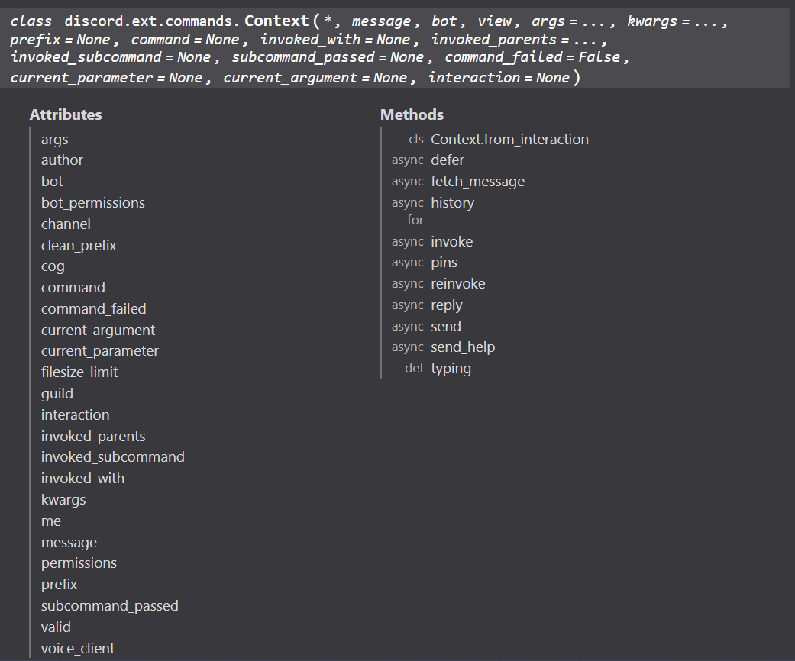
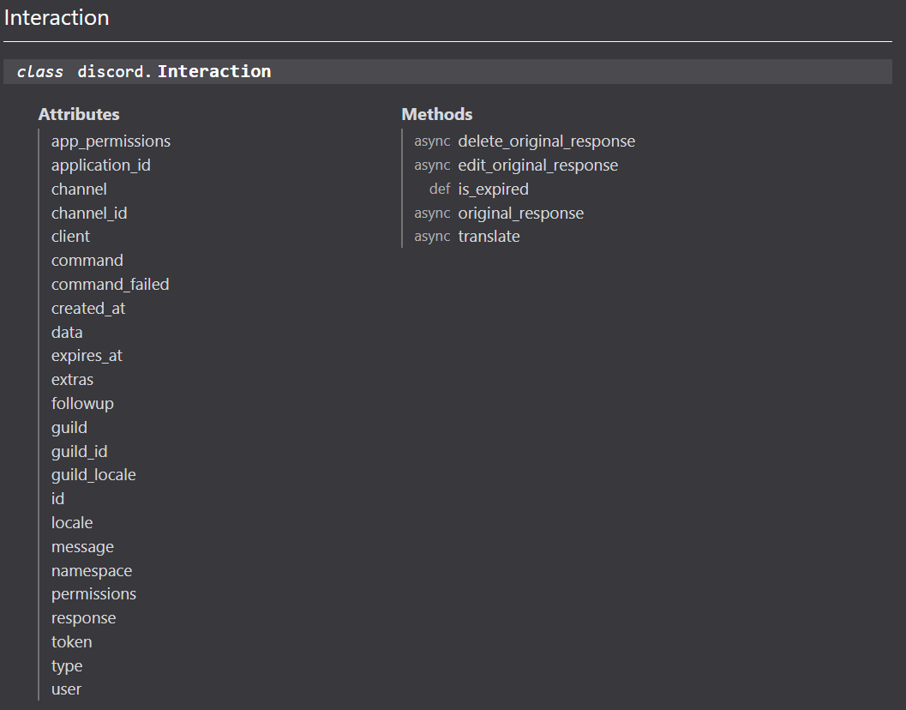
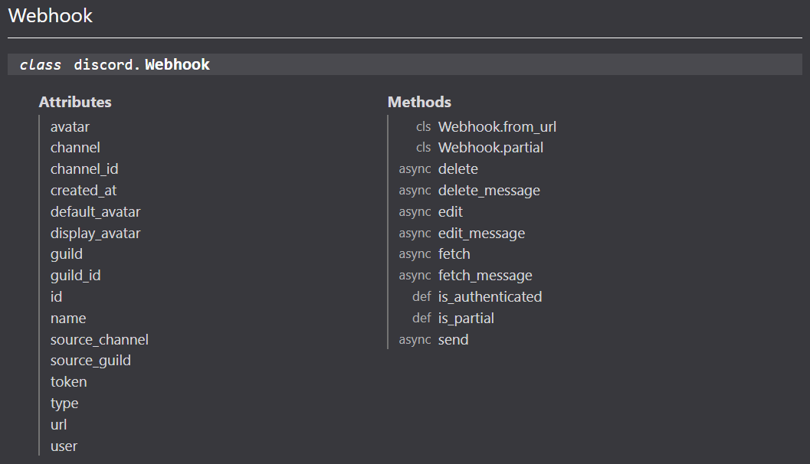

[//]: # "Hey look someone actually took the time to read the markdown file of the slide!"
[//]: # "Message me on discord (earthman7401) or email me (yp11131100@yphs.tp.edu.tw)."
[//]: # "The first person to do so gets a drink from me."

# WE MADE A FUCKING DISCORD BOT LMFAO

\- 20923, 20834, 20838


---

# Contents

1. Introduction
2. Motivation
3. Project Overview
4. Source Control
5. Structure

---

# Introduction

 - [`discord.py`](https://github.com/Rapptz/discord.py)
 - [`Marp`](https://marp.app/)
 - Everything you see in this presentation, including the slides, will be available [on Github](https://github.com/Earthman7401/SDLDiscord).
<sup><sub>(Though I don't know what you can do with these slides)</sub></sup>

---

# Motivation

## N/A

<!-- _footer: hey we needed a sdl project alright -->

---

# Project Overview

 - `docker compose up --build`
 - `git commit -m die`
 - `README.md`

---

# Source Control

 - `.gitignore`
 - Commits
 - Push & Pull

<!-- _footer: Why are requests to push code called "pull requests"? -->

---

# Structure

 - Docker containers
 - Docker volumes
 - `.dockerignore`, `Dockerfile` and `compose.yaml`

---

# Entry Point

`main.py:`
```py
@client.event
async def on_ready():
    print('Adding cogs...')

    for filename in os.listdir('/app/cogs'):
        try:
            # excluding last 3 characters because it's '.py'
            print(f'Loading cog: {filename}')
            await client.load_extension(f'cogs.{filename}'[:-3])
        except commands.ExtensionAlreadyLoaded:
            print(f'Cog {filename} is already loaded')
        except commands.ExtensionNotFound:
            print(f'Cog {filename} not found')

    print(f'{client.user} up and running')

def main():
    client.run(os.environ['TOKEN'], reconnect=True)

if __name__ == '__main__':
    main()
```

---


# Cogs?

 - Modularity
 - Command grouping
 - Permission checking
 - Reduce spaghettiness


---

`./cogs/devcommands.py:`
```py
class DevCommands(commands.Cog, name='Developer Commands'):
    def __init__(self, client: commands.Bot) -> None:
        super().__init__()
        self.client = client

    def cog_check(self, ctx: commands.Context) -> bool:
        return str(ctx.author.id) == os.environ['DEVELOPER_ID']

    @commands.hybrid_command(name='sync')
    async def _sync(self, ctx: commands.Context) -> None:
        if ctx.interaction is not None:
            await ctx.interaction.response.send_message('Syncing...')
        else:
            await ctx.send('Syncing...')

        try:
            synced_commands = await self.client.tree.sync()
            await ctx.send(f'{len(synced_commands)} commands synced: {[command.name for command in synced_commands]}')
        except (discord.HTTPException, discord.DiscordException):
            await ctx.send('Error when syncing commands')

async def setup(client):
    await client.add_cog(DevCommands(client))
```

---

# Commands

 - `commands.Context`
 - Prefixed / Slash / Hybrid



---

# Slash commands

 - `discord.Interaction`
 - Timeout
 - `Interaction.defer()`
 - `Interaction.followup: discord.Webhook`

<!-- _footer: Slash commands are a pain to work with :/ -->

---



---



---

# Thank you for listening!

<sup><sub>Check the [Github repository](https://github.com/Earthman7401/SDLDiscord) for a FREE drink!!!</sub></sup>

<!-- _footer: The link is https://github.com/Earthman7401/SDLDiscord -->