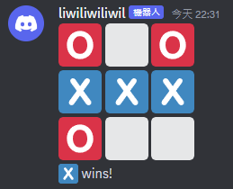
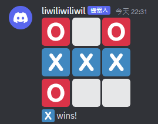
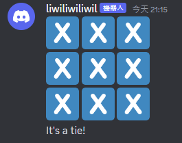
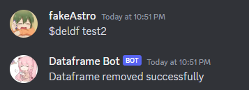
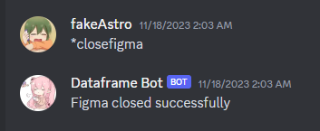

[//]: # "Hey look someone actually took the time to read the markdown file of the slide!"
[//]: # "Message me on discord (earthman7401) or email me (yp11131100@yphs.tp.edu.tw)."
[//]: # "The first person to do so gets a drink from me."

# WE MADE A FUCKING DISCORD BOT LMFAO

\- 20923, 20834, 20838


---

# Contents

1. Introduction
2. Motivation
3. Project Overview
4. Source Control
5. Structure

---

# Introduction

 - [`discord.py`](https://github.com/Rapptz/discord.py)
 - [`Marp`](https://marp.app/)
 - Everything you see in this presentation, including the slides, will be available [on Github](https://github.com/Earthman7401/SDLDiscord).
<sup><sub>(Though I don't know what you can do with these slides)</sub></sup>

---

# Motivation

## N/A

<!-- _footer: hey we needed a sdl project alright -->

---

# Project Overview

 - `docker compose up --build`
 - `git commit -m die`
 - `README.md`

---

# Source Control

 - `.gitignore`
 - Commits
 - Push & Pull

<!-- _footer: Why are requests to push code called "pull requests"? -->

---

# Structure

 - Docker containers
 - Docker volumes
 - `.dockerignore`, `Dockerfile` and `compose.yaml`

---

# Entry Point

`./main.py:`
```py
@client.event
async def on_ready():
    print('Adding cogs...')

    for filename in os.listdir('/app/cogs'):
        try:
            # excluding last 3 characters because it's '.py'
            print(f'Loading cog: {filename}')
            await client.load_extension(f'cogs.{filename}'[:-3])
        except commands.ExtensionAlreadyLoaded:
            print(f'Cog {filename} is already loaded')
        except commands.ExtensionNotFound:
            print(f'Cog {filename} not found')

    print(f'{client.user} up and running')

def main():
    client.run(os.environ['TOKEN'], reconnect=True)

if __name__ == '__main__':
    main()
```

---


# Cogs?

 - Modularity
 - Command grouping
 - Permission checking
 - Reduce spaghettiness


---

`./cogs/devcommands.py:`
```py
class DevCommands(commands.Cog, name='Developer Commands'):
    def __init__(self, client: commands.Bot) -> None:
        super().__init__()
        self.client = client

    def cog_check(self, ctx: commands.Context) -> bool:
        return str(ctx.author.id) == os.environ['DEVELOPER_ID']

    @commands.hybrid_command(name='sync')
    async def _sync(self, ctx: commands.Context) -> None:
        if ctx.interaction is not None:
            await ctx.interaction.response.send_message('Syncing...')
        else:
            await ctx.send('Syncing...')

        try:
            synced_commands = await self.client.tree.sync()
            await ctx.send(f'{len(synced_commands)} commands synced: {[command.name for command in synced_commands]}')
        except (discord.HTTPException, discord.DiscordException):
            await ctx.send('Error when syncing commands')

async def setup(client):
    await client.add_cog(DevCommands(client))
```

---

# Commands

 - `commands.Context`
 - Prefixed / Slash / Hybrid


---

# Slash commands

 - `discord.Interaction`
 - Timeout
 - `Interaction.defer()`
 - `Interaction.followup: discord.Webhook`

<!-- _footer: Slash commands are a pain to work with :/ -->

---


---


---

# Tictactoe


---

# how it looks like



---

# commands
-`tictactoe @sb @sb`
-`place(1~9)`

---

# how the game goes
-start: `tictactoe @Member @Menber`
-first is decided randomly
-use `place (1~9)` to place a 'x' or a 'o' on the board
-ends if a symbol conforms to the `winningConditions`
-or if all the 9 boxes were filled

```py
winningConditions = [
    [0, 1, 2],
    [3, 4, 5],
    [6, 7, 8],
    [0, 3, 6],
    [1, 4, 7],
    [2, 5, 8],
    [0, 4, 8],
    [2, 4, 6]
]
```

---

# end-1


---

# end-2


---

# what if?

```py
if turn != ctx.message.author:
            await ctx.send("It is not your turn.")
            return
```

---
# before
```py
if not gameOver:
            mark = ""
            if turn == ctx.author:
                if turn == player1:
                    mark = ":regional_indicator_x:"#cross in tictactoe (an emoji)
                elif turn == player2:
                    mark = ":o2:"
                if 0 < pos < 10 and board[pos - 1] == ":white_large_square:" :
                    board[pos - 1] = mark
                    count += 1
                    if gameOver == True:
                        await ctx.send(mark + " wins!")
                    elif count >= 9:
                        gameOver = True
                        await ctx.send("It's a tie!")

                    # switch turns
                    if turn == player1:
                        turn = player2
                    elif turn == player2:
                        turn = player1
                else:
                    await ctx.send("Be sure to choose an integer between 1 and 9 (inclusive) and an unmarked tile.")
            else:
                await ctx.send("It is not your turn.")
        else:
            await ctx.send("Please start a new game using the $tictactoe command.")
            
```

---

# after 
```py
if gameOver:
            await ctx.send("Please start a new game using the $tictactoe command.")
            return

        if turn != ctx.message.author:
            await ctx.send("It is not your turn.")
            return

        if not (0 < pos < 10 and board[pos - 1] == ":white_large_square:"):
            await ctx.send("Be sure to choose an integer between 1 and 9 (inclusive) and an unmarked tile.")
            return

        mark = ":regional_indicator_x:" if turn == player1 else ":o2:"
        board[pos - 1] = mark
        count += 1
        
        line = ""
        for x in range(len(board)):
            if x == 2 or x == 5 or x == 8: # x % 3 == 2
                line += " " + board[x]
                await ctx.send(line)
                line = ""
            else:
                line += " " + board[x]
```

---

 # Chart


---

# libraries

- `pandas`
- `matplotlib`
- `json`

---

# pandas
- NumPy
- Dataframe
- Support various formats I/O
- better than Excel?

<!-- _footer: but Excel got a world champion while pandas doesn't, unfair : ( -->

---

# Dataframe?
- a data structure class in `pandas`
- basically a atwo dimensional array
- consist of **index** and **Columns**
---

# matplotlib
- For art, chart
- drawing tool for nerds
 


<!-- _footer: from Twitter User @S_Conradi -->

---

# drawing in matplotlib


---

`./app/cogs/chart.py`
```py

        df_dir=f"{DATA_DIR}/{title}"
        data=f"{DATA_DIR}/{title}/{title}.json"
        df_info = json.load(open(data, encoding="utf-8", mode='r'))
        x_label=df_info['Column1']
        y_label=df_info['Column2']
        x_index = df_info['Column1_index']
        y_index = df_info['Column2_index']
        #create chart
        if mode == "0":
            plt.plot(x_index, y_index, color)
        elif mode == "1":
            x_int=[int(x) for x in x_index]
            y_int=[int(y) for y in y_index]
            plt.bar(x_int, y_int, color=color)
        plt.xlabel(x_label)
        plt.ylabel(y_label)
        plt.title(title)
        #save chart
        if os.path.exists(f'{df_dir}/{title}output'):
            if os.path.isfile(f'{df_dir}/{title}output/{title}.png'):
                os.remove(f"{df_dir}/{title}output/{title}.png")
                plt.savefig(f"{df_dir}/{title}output/{title}.png")
            else:
                plt.savefig(f"{df_dir}/{title}output/{title}.png")
        else:
            os.mkdir(f'{df_dir}/{title}output')
            os.chmod(f'{df_dir}/{title}output', 0o777)
            plt.savefig(f"{df_dir}/{title}output/{title}.png")
```

---

# json
- save dataframe

---

`./app/cogs/chart.py`
```py 
@commands.hybrid_command(name="appenddf", description="add new index to an exist dataframe")
    async def appenddf(self,ctx,name: str,arg2: str):
        """
        the function is for adding index into an existed dataframe
        """
        df_dir=f"{DATA_DIR}/{name}"
        data=f'{DATA_DIR}/{name}/{name}.json'
        index=arg2.split(",")
        #read dataframe
        df_info = open(data, encoding="utf-8", mode='r')
        #there problem here: it should be loaded into dict instead of str
        df_append=json.load(df_info)#load json file
        #3. check the type of the index
        for i in range (len(df_append)):
            df = df_append[i]
            d = list(df.keys())
            dict_key = d[0]
            dict_value = df[dict_key]
            if  dict_value == "N/A":
                df[dict_key] = [float(index[i])]
            else:
                df[dict_key].append((float(index[i])))
        df_info.close()
        #write dataframe
```

---

<center>

| Python           | JSON   |
| ---------------- | ------ |
| dict             | object |
| **list**, tuple      |**array**  |
| str              | string |
| int, long, float | number |
| True             | true   |
| False            | false  |
| None             | null   |

</center>

---

## An example of how the data stores using JSON array
>
```json
[{"year": [2021.0, 2022.0, 2023.0, 2020.0]}, {"gdp": [50000.0, 10000.0, 30000.0, 120000.0]}]
```

---

# commands
- `createdf`
- `appenddf`
- `outputdf`
- `deldf`
- `outputchart`
- `closefigma`

---

## `createdf`


```json
[{"year": "N/A"}, {"gdp": "N/A"}]
```

---

## `appenddf`


```json
[{"year": [2021.0, 2022.0, 2023.0]}, {"gdp": [50000.0, 10000.0, 30000.0]}]
```

---

## `outputdf`


---

## `deldf`



---

## `outputchart (line)`


---

## `outputchart (bar)`


---

## `outputchart (bar)`



---

# about closefigma


---

# Thank you for listening!

<sup><sub>Check the [Github repository](https://github.com/Earthman7401/SDLDiscord) for a FREE drink!!!</sub></sup>

<!-- _footer: The link is https://github.com/Earthman7401/SDLDiscord -->